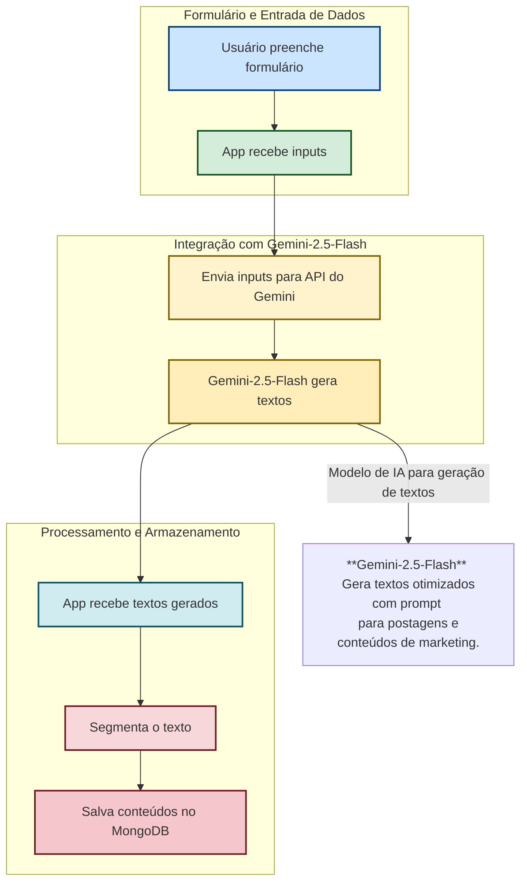

### Estrutura dos diretórios
```
app/
├── dist/                # Pasta de saída dos arquivos gerados na build
├── node_modules/        # Dependências instaladas via npm
├── src/                 # Código-fonte da aplicação
│   ├── App.tsx          # Componente principal da aplicação
|   ├── api.ts           # Configuração para utilizar api do modelo de linguagem
│   ├── index.css        # Arquivo de estilos global
│   ├── main.tsx         # Ponto de entrada da aplicação React
│   └── vite-env.d.ts    # Declarações de tipos específicas do Vite
├── .env                 # Variáveis de ambiente
├── .gitignore           # Arquivo para ignorar arquivos/pastas no Git
├── eslint.config.js     # Configuração do ESLint
├── index.html           # Arquivo HTML principal
├── package-lock.json    # Arquivo de lock do npm
├── package.json         # Gerenciador de scripts e dependências do projeto
├── postcss.config       # Configuração do PostCSS (possivelmente sem extensão, mas indica a configuração)
├── tailwind.config.js   # Configuração do Tailwind CSS
├── tsconfig.app.json    # Configuração TypeScript específica para o app
├── tsconfig.json        # Configuração geral do TypeScript
├── tsconfig.node.json   # Configuração TypeScript para scripts/node
└── vite.config.ts       # Configuração do Vite
```
### Fluxo do APP

### **Modelo de Banco de Dados MongoDB**

A seguir está a modelagem para a **coleção `posts`**, que armazena os posts gerados.

#### **📂 Coleção: `posts`**

```json
{
  "_id": ObjectId("65fabc1234567890abcdef12"),
  "segmento": "Loja de Roupas Fitness",
  "produto": "Conjunto de academia de secagem rápida",
  "publico_alvo": "Mulheres que praticam exercícios físicos regularmente",
  "problema": "Você já passou pela frustração de treinar com roupas desconfortáveis e que não absorvem o suor?",
  "solucao": "Nosso conjunto fitness é feito com tecido de secagem ultra rápida e ajuste perfeito ao corpo, garantindo liberdade de movimento e máximo conforto!",
  "cta": "🛍️ Garanta o seu agora! Acesse nossa loja online e treine com mais estilo e performance.",
  "canal_publicacao": "Instagram",
  "criado_em": ISODate("2025-03-20T10:30:00Z")
}
```
