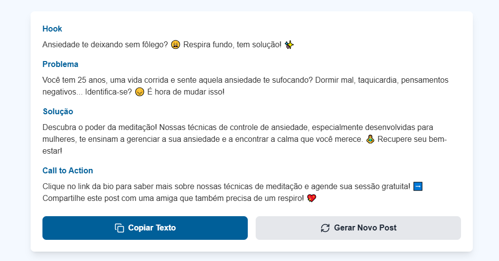
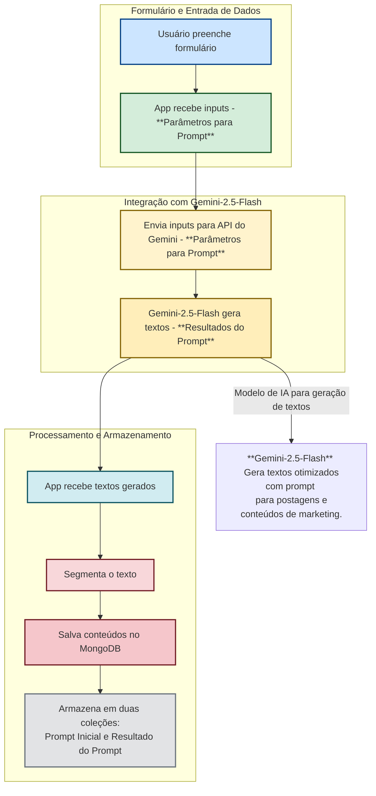
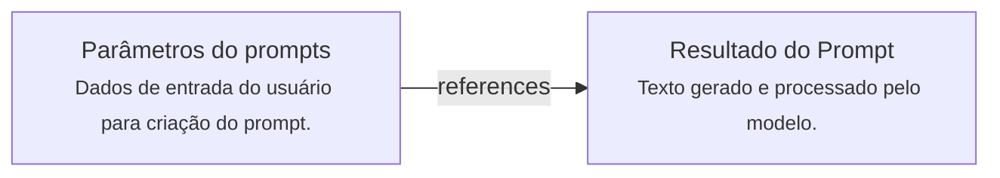

# Gerador de Conteúdos para Posts
## Iniciando o aplicativo em ambiente de desenvolvimento

### 1. Instalar dependências do backend
```bash
cd backend
npm install
cd ..
```

### 2. Instalar dependências do frontend
```bash
cd interface
npm install
cd ..
```

### 3. Iniciar ambos os serviços (frontend e backend juntos)
```bash
npm run dev
```


## Estrutura básica do projeto
```
app/
├── backend/       # Contém a API e a comunicação com o banco de dados
├── interface/     # Contém o frontend desenvolvido
├── package.json   # Arquivo na raiz que define scripts para rodar backend e frontend juntos

```
## Fluxo do APP

## Dependências
Dependências para o funcionamento correto do app (front-end e back-end):

| Dependência | Versão | Projeto |
|-------------|--------|---------|
| concurrently | ^8.0.0 | Front-end |
| lucide-react | ^0.344.0 | Front-end |
| react       | ^18.3.1 | Front-end |
| react-dom   | ^18.3.1 | Front-end |
| axios       | ^1.8.4 | Back-end |
| cors        | ^2.8.5 | Back-end |
| dotenv      | ^16.4.5 | Back-end |
| express     | ^4.19.2 | Back-end |
| mongodb     | ^6.8.0 | Back-end |
| mongoose    | ^8.6.1 | Back-end |

Observação: A dependência `concurrently` é frequentemente usada para executar múltiplos comandos simultaneamente, geralmente no arquivo `package.json` do projeto front-end, mas pode ser usada em qualquer lugar onde seja necessário. A dependência `axios` aparece em ambos os projetos, mas isso não é incomum, pois pode ser usada tanto no front-end quanto no back-end para fazer requisições HTTP.


## Modelo de Banco de Dados MongoDB

A seguir está a modelagem para a **coleção `posts`**, que armazena os posts gerados.

#### **📂 Coleção que representa os parâmetros de prompts gerados pelo usuário: `prompts_iniciais`**

```json
{
  "segmento": "string",             // Segmento de mercado (ex: tecnologia, saúde)
  "produto": "string",              // Nome do produto ou serviço
  "publico_alvo": "string",         // Público ideal (ex: jovens empreendedores)
  "problema": "string",             // Problema que o público enfrenta
  "solucao": "string",              // Como o produto resolve o problema
  "cta": "string",                  // Chamada para ação (ex: experimente grátis)
  "canal_publicacao": "string",     // Onde será publicado (ex: Instagram, email)
  "criado_em": "date"               // Data de criação do prompt
}

```
#### **📂 Coleção que representa a resposta do modelo de linguagem gerados a partir do prompt: `resultados_prompts`**
```json
{
  "prompt": "ObjectId",             // Referência ao prompt_inicial correspondente
  "hook": "string",                 // Frase curta e chamativa com emojis
  "problema": "string",             // Explicação clara do problema
  "solucao": "string",              // Descrição de como o produto resolve
  "cta": "string",                  // Chamada para ação
  "gerado_em": "date"               // Data de geração do resultado
}
```

